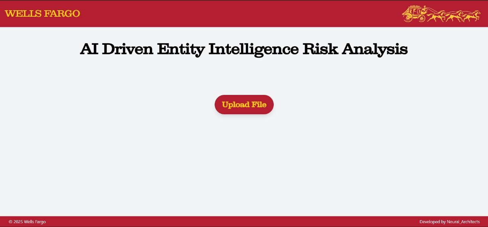
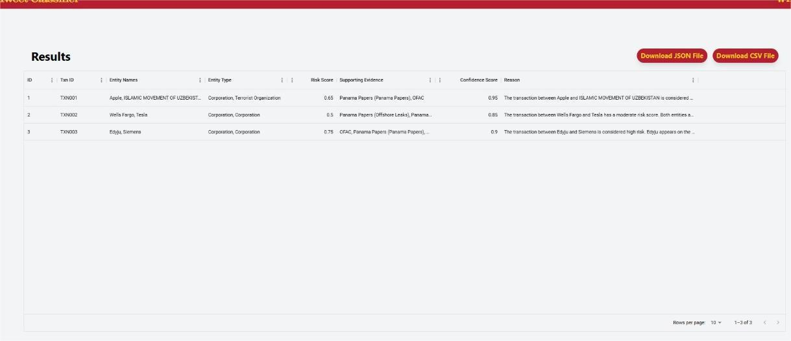
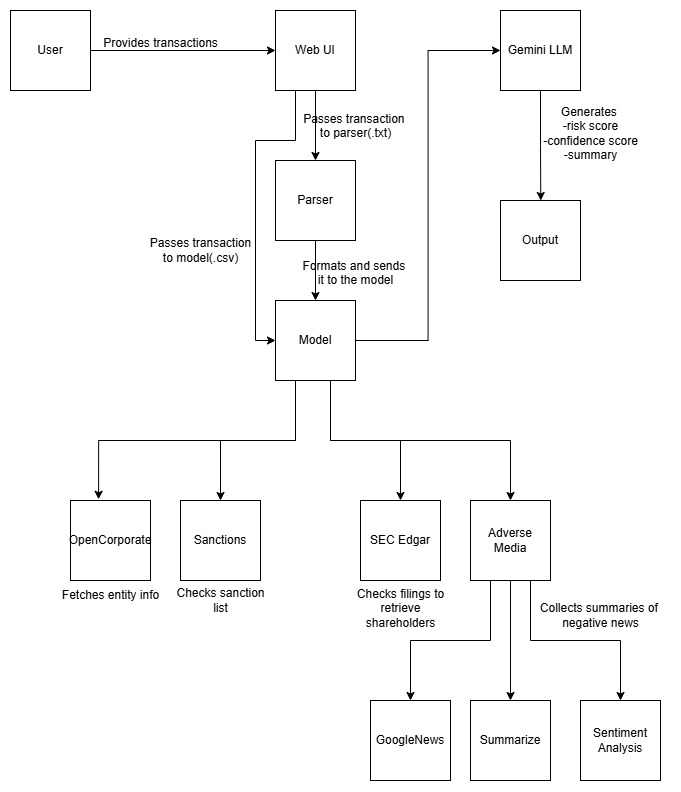

# 🚀 AI-Driven Entity Intelligence & Risk Analysis 🌟

## Description
The AI-Driven Entity Intelligence & Risk Analysis System is designed to automate the process of identifying, verifying, and risk-scoring financial transactions between entities. It integrates multiple data sources such as sanction lists, financial filings, and adverse media to assess transaction risks. The system reduces manual effort, enhances accuracy, and provides a comprehensive evaluation of transactional risks.

## 📌 Table of Contents
- [Introduction](#introduction)
- [Demo](#demo)
- [Inspiration](#inspiration)
- [What It Does](#what-it-does)
- [How We Built It](#how-we-built-it)
- [Challenges We Faced](#challenges-we-faced)
- [How to Run](#how-to-run)
- [Tech Stack](#tech-stack)
- [Team](#team)

---
<a name="introduction"></a>
## 🎯 Introduction
The **AI-Driven Entity Intelligence & Risk Analysis System** addresses the challenges faced in modern-day financial reconciliations by:
1. Automating anomaly detection in transactions
2. Making the job of analysts easier by reducing time and effort in background checks.
3. Reduces the possibility of human error.

<a name="demo"></a>
## 🎥 Demo 
📹 [Video Demo](https://drive.google.com/file/d/1P36hNL8-23ZYgR8YyFUUKrgsXGjpIQnC/view?usp=sharing)  
---
Here are some screenshots of the application:

1. **Dashboard**:
   
   

2. **Result**:
   
   

3. **Architecture**:
   
   

<a name="inspiration"></a>   
## 💡 Inspiration
This project was created during the [Technology Hackathon 2025] to showcase how AI-driven workflows can improve risk analysis processes.

<a name="what-it-does"></a>
## ⚙️ What It Does

### Features
- **Entity Extraction**:
   - Extracts and verifies corporate entities involved in transactions.
- **Sanction Screening**:
   - Checks if entities or their shareholders are listed in various sanction lists (OFAC, EU, ICIJ leaks).
- **Shareholder Analysis**:
   - Extracts shareholder information from SEC Edgar filings.
- **Adverse Media Analysis**:
   - Scrapes Google News API to check for negative news associated with entities.
- **Risk Scoring**
   - Calculates a risk score based on multiple risk factors, including sanctions, financial stability, country risk, and adverse media sentiment.
- **Supporting Evidence**
   - Provides references from OpenCorporate, SEC Edgar, sanction lists, and news sources to justify risk classification.

<a name="how-we-built-it"></a>
## 🛠️ How We Built It
- **Data Sources**
   - Sanction Lists: OFAC, EU, ICIJ leaks
   - Financial Records: SEC Edgar (CIK Lookup, SC 13G/13D filings)
   - Corporate Information: OpenCorporates API
   - Adverse Media: Google News API
   - Transactional Data: User-provided CSV file
- **Risk Factors & Weights**
   - | Risk Factor               | Weight |
     |---------------------------|--------|
     | Sanctions                 | 50     |
     | Financial Risk            | 30     |
     | Country Risk              | 20     |
     | Adverse Media             | 25     |
     | Shareholder Sanctions     | 25     |
     | Shareholder Negative News | 15     |

3. **Run the Application**:
   - Start the backend:
     ```bash
     python app.py
     ```
   - Start the ReactJS frontend:
     ```bash
     npm start
     ```

   ## Usage
   1. **Upload Dataset**:
    - Upload your financial dataset (e.g., a CSV file) via the provided interface.
   
   2. **Extract Company Information**:
    - Extract company information by calling the OpenCorporate API
   
   3. **Check Sanction Lists**:
    - Once the info is extracted, the sanction lists are checked to see if the entities are present in any of the sanction lists.

   4. **Retrieve Shareholder Data**:
    - Shareholders are then retrieved using the SEC Edgar website if present. The Sanction lists are once again checked to see if any of the shareholders are present.

   5. **Analyze Adverse Media**:
    - The Google news api is used to retrieve the top news articles for the entities. A summarizer is then used to summarize the article followed by a sentiment analysis of the same. If found to be negative, the articles are stored. The same is done for the 
      shareholders as well.

   6. **Compute Risk Score**:
    - Based on the weights that we provide, a risk score is calculated. Along with this a confidence score is also calculated using the scores returned by sentiment analyser and the other data through which we get our analysis.

   7. **Summary Generation**:
    - A summary is then generated by the LLM that we use which takes in all the data that we provide, calculates the risk score, assigns a risk level and provides an explanation of why that conclusion was reached.

<a name="challenges-we-faced"></a>
## 🚧 Challenges We Faced
   - OpenCorporate API is not publicly available, access has to be requested.
   - The api key that we received does not have access to all data and excludes fields like company owner, financials, parent companies etc..
   - The SEC Edgar filings API did not work as expected and we had to rely on web scraping to retrieve information about the company shareholders.
   - Ensuring that the same model can work for both structured and unstructured data was also a challenge.

<a name="how-to-run"></a>
## 🏃 How to Run
1.## Setup Instructions
Follow these steps to set up the project locally.

1. **Clone the Repository**:
   ```bash
   git clone (https://github.com/ewfx/aidel-neural-architects)
   cd code/src
   ```

2. **Set Up Dependencies**:
   - Install Node.js dependencies (if required):
     ```bash
     npm install
     ```
<a name="tech-stack"></a>
## 🏗️ Tech Stack
- 🔹 Frontend: - HTML, CSS, JavaScript
- 🔹 Backend:  Flask RESTful API
- 🔹 Libraries Used: BeautifulSoup, transformers, google.generativeai
- 🔹 Other: OpenCorporate API, SEC Edgar filings, GoogleNews API, HuggingFace models(summarizer, sentiment analysis)

<a name="team"></a>
## 👥 Team
- **Joel Vijo** - [GitHub](https://github.com/Joel-Vijo) | [LinkedIn](https://www.linkedin.com/in/joel-vijo-39a921220/)
- **Lalit Mangal** - [GitHub](https://github.com/shinigami1908) | [LinkedIn](https://www.linkedin.com/in/lalit-mangal/)
- **Pranjal Singla** - [GitHub](https://github.com/pranjal-singla) | [LinkedIn](https://www.linkedin.com/in/pranjal-singla/)
- **Vanshika Nehra** - [GitHub](https://github.com/VanshikaNehra23) | [LinkedIn](https://www.linkedin.com/in/vanshikanehra/)
- **Vignesh S** 
